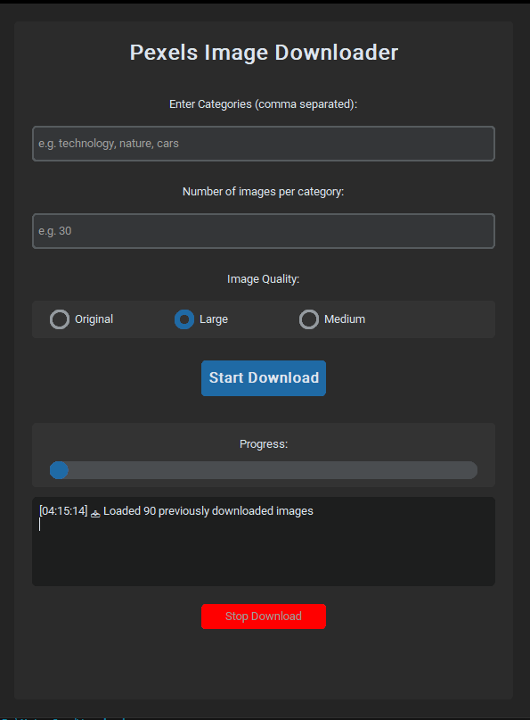

# Pexels Image Downloader

A modern GUI application built with Python and CustomTkinter for downloading high-quality images from Pexels API in bulk.

## Features

- 🖼️ **Bulk Image Downloads**: Download multiple images across different categories
- 🎨 **Quality Selection**: Choose from Original, Large, or Medium quality
- 📁 **Organized Storage**: Automatically creates timestamped folders for each category
- 🚫 **Duplicate Prevention**: Prevents downloading the same image multiple times
- 📊 **Progress Tracking**: Real-time progress updates and status messages
- 🛑 **Cancellable Downloads**: Stop downloads at any time
- 🌙 **Dark Theme**: Modern dark UI using CustomTkinter

## Prerequisites

- Python 3.7 or higher
- Pexels API Key (free from [Pexels Developers](https://www.pexels.com/api/))

## Installation

1. Clone this repository:
```bash
git clone https://github.com/yourusername/pexels-image-downloader.git
cd pexels-image-downloader
```

2. Install required dependencies:
```bash
pip install -r requirements.txt
```

3. Get your Pexels API key:
   - Visit [Pexels API](https://www.pexels.com/api/)
   - Create a free account
   - Generate an API key

4. Update the API key in the code:
   - Open `main.py`
   - Replace `API_KEY` with your actual Pexels API key

## Usage

1. Run the application:
```bash
python main.py
```

2. Enter your desired categories (comma-separated)
3. Set the number of images per category
4. Choose image quality
5. Click "Start Download"

## Configuration

- **Maximum images per category**: 1000
- **Maximum categories**: 10
- **Supported formats**: JPG, JPEG, PNG, WebP
- **Rate limiting**: Built-in handling for API rate limits

## Project Structure

```
pexels-image-downloader/
├── main.py              # Main application file
├── requirements.txt     # Python dependencies
├── README.md           # Project documentation
├── .gitignore          # Git ignore rules
└── download_log.txt    # Download history (created automatically)
```

## Screenshots



## Contributing

1. Fork the repository
2. Create a feature branch (`git checkout -b feature/amazing-feature`)
3. Commit your changes (`git commit -m 'Add some amazing feature'`)
4. Push to the branch (`git push origin feature/amazing-feature`)
5. Open a Pull Request

## License

This project is licensed under the MIT License - see the [LICENSE](LICENSE) file for details.

## Disclaimer

This tool is for educational and personal use only. Please respect Pexels' terms of service and the photographers' rights. Always check the license of each image before commercial use.

## Acknowledgments

- [Pexels](https://www.pexels.com/) for providing the amazing API and free stock photos
- [CustomTkinter](https://github.com/TomSchimansky/CustomTkinter) for the modern GUI framework
